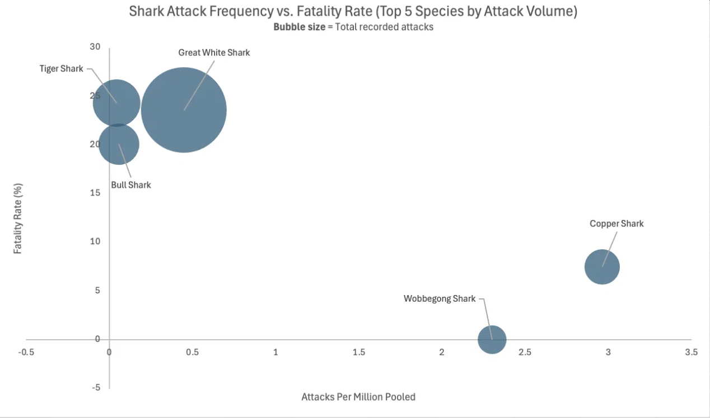
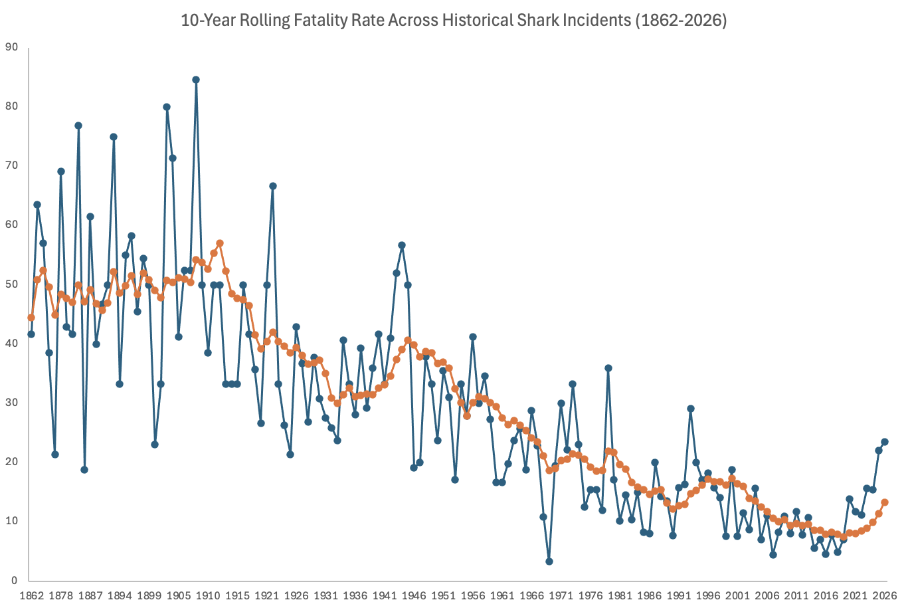
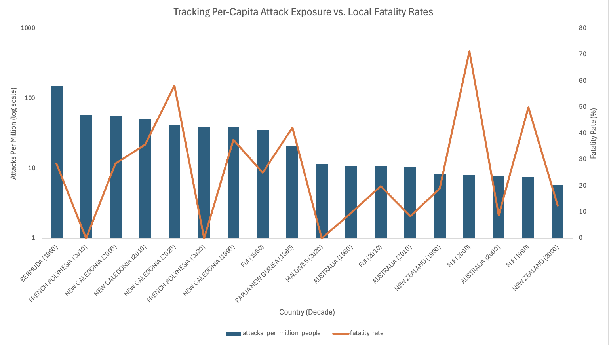
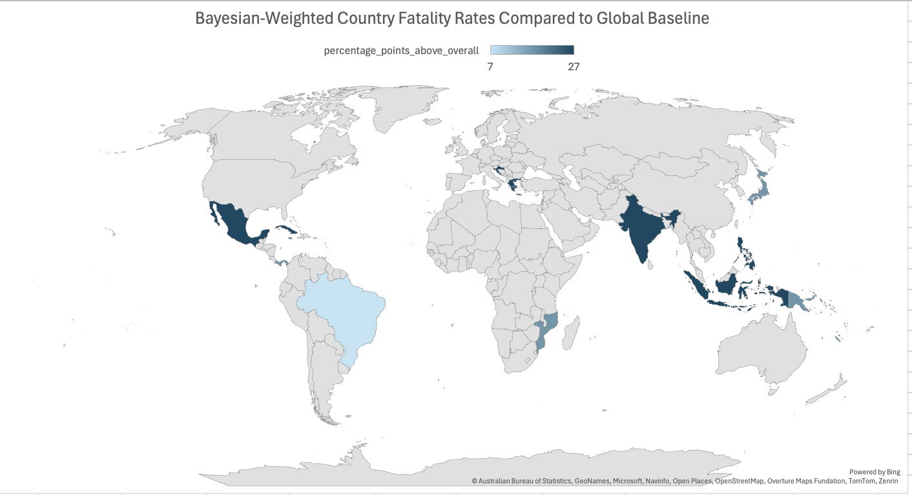

# Shark Attack Data Cleaning & Analysis

An end-to-end PostgreSQL project to transform the Global Shark Attack File (GSAF), which is a very messy, text-based data source containing almost two-hundred years worth of shark attacks, into a clean, analysis-ready format, including a customized scoring metric for data cleanliness, as well as several analytic results normalized by population. 

The original data cleanliness score stood around 77%, while **my cleaned GSAF data stands at roughly 89%**. If you exclude values that aren't recoverable (the completeness of certain columns, i.e., "Name") from the average, the data cleanliness score goes **from roughly 76% to 96%**.

*(Note: the cleaned GSAF file has 120 fewer rows than the original GSAF file - duplicates were removed, as well as rows where there was no shark involvement.)*

I selected GSAF specifically because it has not been cleaned prior to delivery. The date fields, country fields, time fields, and species fields were all in unstructured, free-form text so I was required to create a pipeline of steps to accomplish cleaning instead of simply dropping nulls.

## What's in this project

- **`GSAF_to_CSV.ipynb`**: Transform the raw GSAF data, as well as the country codes data, from `.xls`/`.xlsx` to `.csv`
- **`01_make_table.sql`**: Set up the raw GSAF table; Create a "country" reference table; Import world bank population data in unpivot format (wide to long). 
- **`02_update_gsaf.sql`**: First round of cleaning: parse date field into month/day format; Convert name-type-activity fields into quality-status bins to use later as scoring fields.
- **`03_data_quality_scores.sql`**: Create a stored procedure to later quantify data-quality improvements across 24 different aspects (validity, completeness, consistency) into a `failures` table.
- **`04_consolidate.sql`**: Main cleaning functions: Standardize case number formats; Fix date issues; Match fuzzy-country-name (use levenshtein); Bucket free-text time fields; Resolve fatality flag with injury field text; Consolidate multiple species fields; Remove duplicate records; Standardize incident type fields.
- **`05_run_all.sql`**: Run the entire process - Build → Clean → Score Before/After → Overall Quality Score.
- **`06_analysis.sql`**: Fatality Rates By Activity/Species/Country; Population-Normalized Attack Rates; Geographic Concentration Over Time; Countries Deviating Most From Global Average Fatality Rate.

## Headline findings

- **Great White, Tiger, and Bull Sharks have roughly the same ~20–25% fatality rates**, and they have sufficient sample sizes to provide reliable estimates. The Wobbegongs and Coppers, however, can swing wildly. They are not valid representatives of these species' fatality rates due to very low sample sizes.
  

-  **Since 1916, there has been a substantial decline in the 10 year moving fatality rate**, which could likely be attributed to significant advances in emergency care and documentation since the 1900s - though this study does not have the resources to identify the exact mechanisms behind this advancement, we would need much larger sample sizes than those available here before we could clearly establish a trend.

- **Rates of attacks per capita paint an entirely different picture than simply looking at total numbers**. While many small nation states (Bermuda, French Polynesia & New Caledonia) have high per-capita and 50-year growth rates in terms of attack frequency, these are primarily examples of how a small denominator will cause an additional several attacks in each country to drastically increase the rate, and not indicative of an increased danger of being attacked while visiting.

- **There are some countries with fatality rates well above the world average for meaningful volumes of attacks (>20 reported)**. These represent a stronger indicator of actual risk compared to the above per-capita island effect, because the Baysesian-weighted high fatality rate cannot be accounted for by small sample size.

*(Chart-by-chart breakdowns with axis definitions and detailed findings are in [`CHARTS.md`](./CHARTS.md).)*

## Tools

PostgreSQL (stored procedures, window functions, regex, `fuzzystrmatch` for fuzzy country matching). Pandas used to convert the original GSAF `.xls` to `.csv`. Charts built in Excel from query outputs.

## Known limitations / what I'd improve next

* Year validation is too permissive - it currently only checks that "Year" is 4 digits, not that it's a plausible/real year, which lets a few clearly invalid years slip through into the trend charts.

* No automated tests; the quality scoring framework doubles as a sanity check but isn't a substitute for unit tests on the cleaning procedures.

* In the past, the data-quality scripts overwrote the same logging tables; therefore, if you ran both the clean-data and raw-log processes, they both wrote their results to the same logging-table, resulting in the raw-log results being overwritten by the clean-data results. I added a source table column to the data quality table, and removed the drop statement, in order to log both at the same time. I also grouped by source table in the later average score calculations.

(*To reproduce this project, see [`SETUP.md`](./SETUP.md).*)
